****SENG 637 - Dependability and Reliability of Software Systems****

**Lab. Report \#5 – Software Reliability Assessment**

| Group \#:       |              4              |
|-----------------|-----------------------------|
| Student Names:  |  1. Mahdi Jaberzadeh Ansari |
|                 |  2. Aadharsh Hariharan      |
|                 |  3. Shirin Yamani           |
|                 |  4. Rahul Ravi              |

# 0. Link of demo video 

[Here](./Demo.mp4) is the link to our demo video.

# 1. Introduction

This lab included analysis of integration test data using reliability assessment tools. The purpose of this assignment was to give us hands-on experience on assessing the reliability of a hypothetical system given its failure data collected during integration testing. As there are two ways to assess failure data (i.e., Reliability growth testing and Reliability Demonstration Chart), the lab instruction had two sections. In the following in sections 2 and 3 we discussed in more details about each of these methods. We tried to install different reliability growth assessment tools and assess their functionality. As discussed in section 7, some of the tools were not useable in modern operating systems and we reported them. By completing this assignment:

- we gained an understanding of what reliability growth testing is and why it is useful.
- We are now able to measure the failure rate, MTTF and reliability of the SUT through analyzing the test data.
- We became familiar with the features and usage of different reliability growth testing tools.

# 2. Assessment Using Reliability Growth Testing 

For this Particular part we have used the C-SFRAT tool which was run on python. We loaded the faliure data onto the tool. For this analysis we have looked at the covariate C (i.e., Computer time faliure identification measured in hours) as that is the failure data. The resulting plotted graph in tabular and line graph is as shown below:-

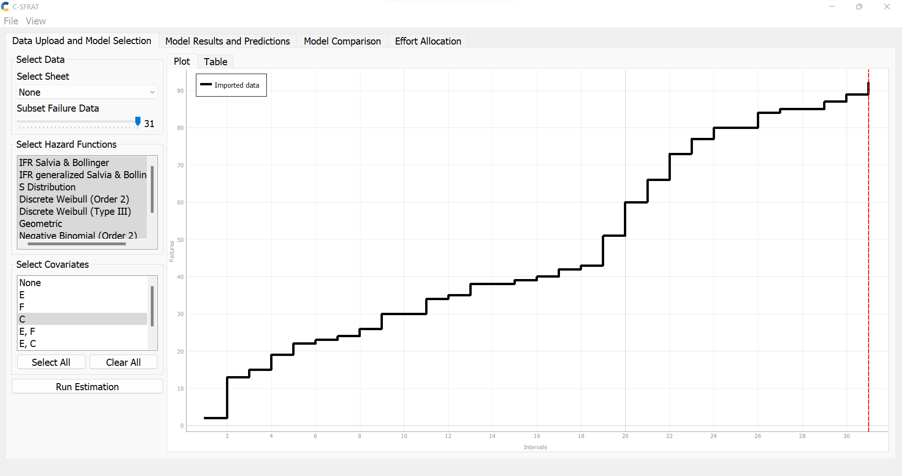
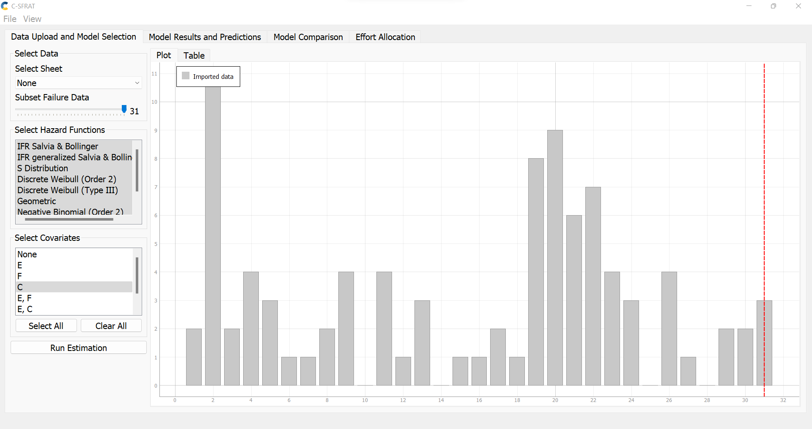

We compared all the different model present in the tool such as Geometric, S-Distribution, etc and plotted the goodness of fit of each model over the given data. It is as shown below in both tabular and line graph format:-

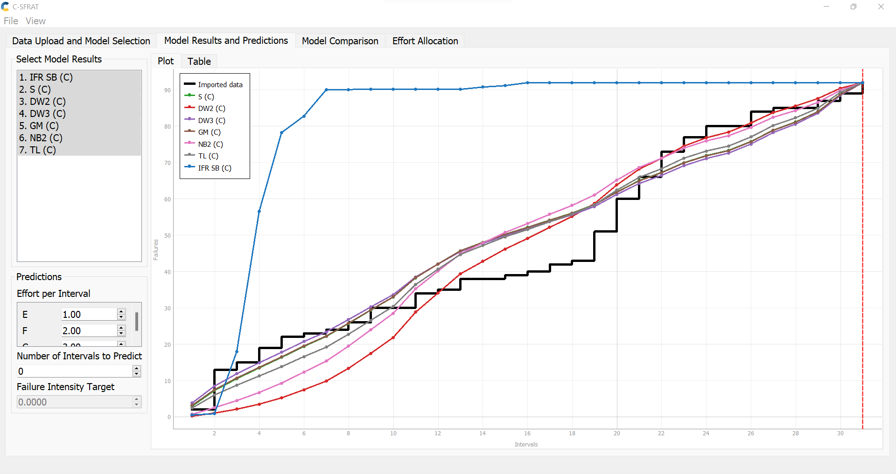
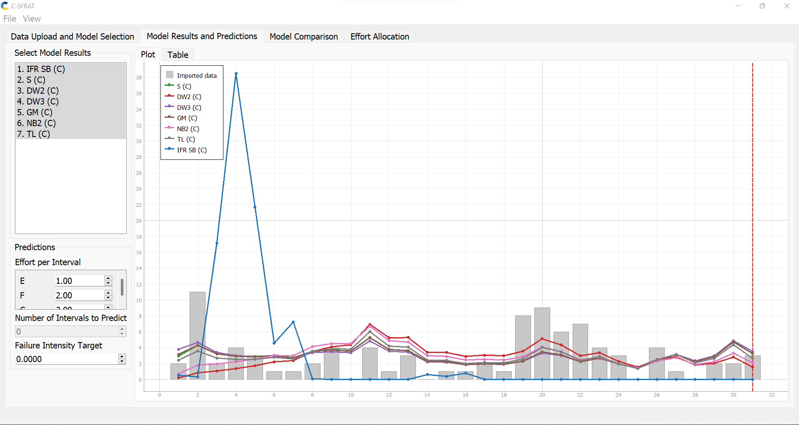

As we can see from the above pictures IFR SB model has the worst goodness of fit and hence is not a reliable model for the prediction of future faliures. The other model looks very close and can be further distinguished with the model comparison option in the tool. It is as shown below:-

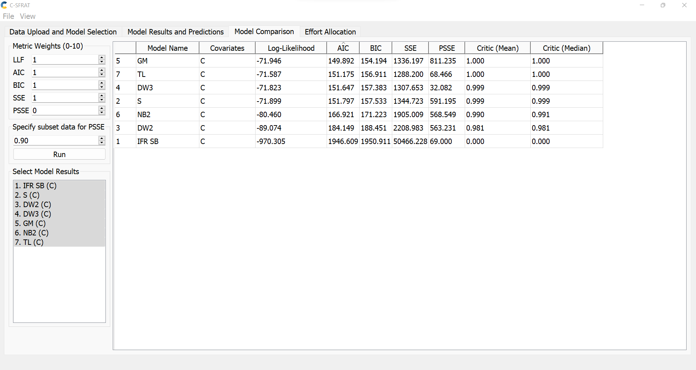

As it can be seen by sorting based on the AIC and BIC values (lower AIC and BIC better goodness of fit) IFC SB has the is the lowest in the compariosn which backups our oservations from the graph. From the table we can also see that GM model has the best goodness of fit as compared to all the other models. Hence we can use this model for faliure prediction. The given data set contained values for upto 32 intervals and we will nowe predict how the faliure count will be for 20 more intervals using GM model. It is as shown below:-

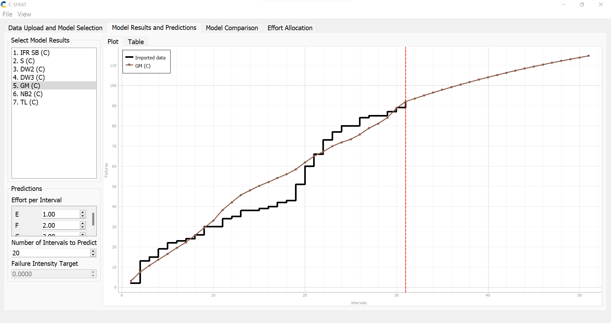

We can see that from the given data as 32 interval we are getting 92 faliures and as per the model prediction we will get approximatelly 115 faliures at 50 time intervals.

We can also calculate the the number of intervals it can take to reach a desired faliure intensity level. For a flaiure intesity level of 0.3 based on the GM modle it shows that it akes approximately 50 more intervals. It is as shown below:-

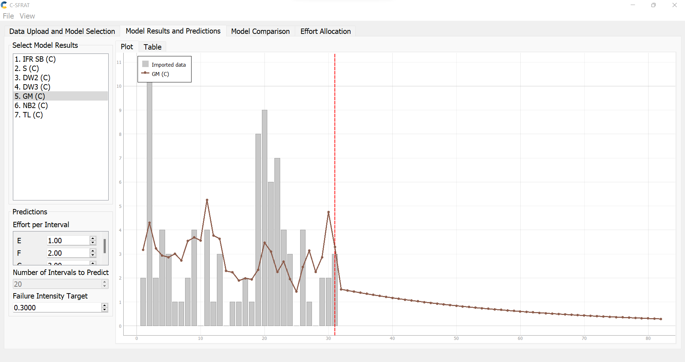

We can also compare predictions and faliure intensity level of each model using the tool. It is as shown below:-

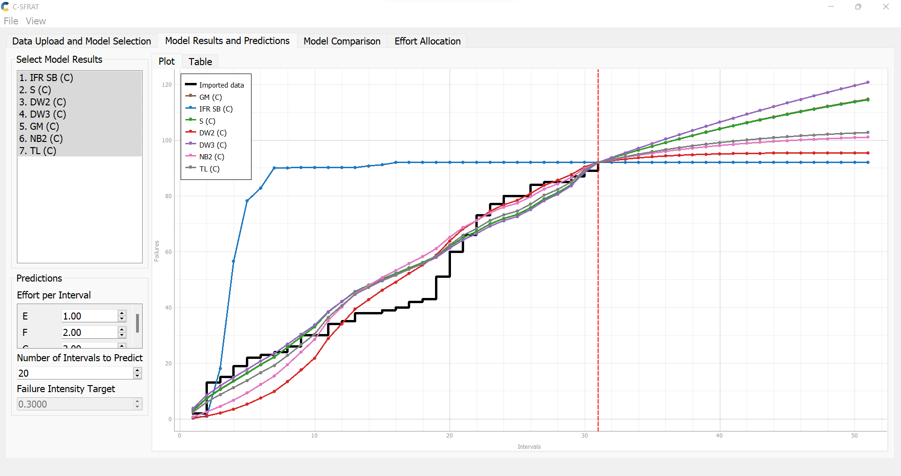
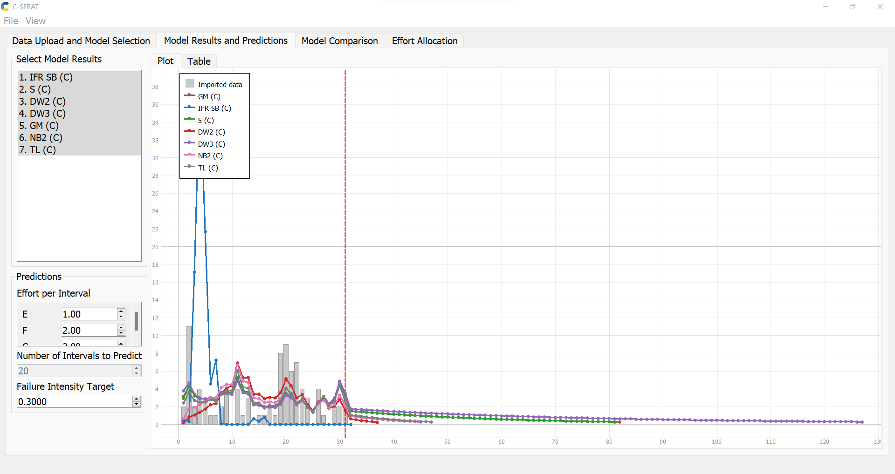

# 3. Assessment Using Reliability Demonstration Chart 

As we had 32 entries inside the [input data](./failure-data-a5/failure-dataset-a5.csv), we first extended the [RDC.xls](./RDC/RDC0.xls) to support 32 entries. The original [RDC.xls](./Assignment%205%20-%20artifacts/RDC-11/Reliability-Demonstration-Chart.xls) only supports 16 entery points (i.e. failure data). Extending this file is outside of the concept of this report, therefore, we jump from the steps that we have done to extend the file. However, just to say in short, we applied changes on 'Risk Trade-Off Parameters' and 'Plot Data' sheets to make it ready for supporting 32 failure data. 

For using the RDC.xls, we prepared provided hypothetical input data based on the documentations. For this purpose, we needed to apply some conversion on the data. First we calculated the cumulative values for column FC. Then we needed to convert column C to a time of the day as the tool works based on the date and time. Finally we needed to calculate the input event when observed. As recommended in the RDC.xls, we just entered time units for the observation. Therefore, we calculated the cumulative value for that column too. Here are the converted numbers. 

|	Cumulative FC	|	Covert C to time of the day 	|	Cumulative C |
|-------|-----------|-------|
|	2	|	9:00	|	0.5	|
|	13	|	11:48	|	3.3	|
|	15	|	12:48	|	4.3	|
|	19	|	13:18	|	4.8	|
|	22	|	13:48	|	5.3	|
|	23	|	14:48	|	6.3	|
|	24	|	15:18	|	6.8	|
|	26	|	17:48	|	9.3	|
|	30	|	20:48	|	12.3	|
|	30	|	23:48	|	15.3	|
|	34	|	5:48	|	21.3	|
|	35	|	9:48	|	25.3	|
|	38	|	13:48	|	29.3	|
|	38	|	14:48	|	30.3	|
|	39	|	15:48	|	31.3	|
|	40	|	15:48	|	31.3	|
|	42	|	16:18	|	31.8	|
|	43	|	16:48	|	32.3	|
|	51	|	18:48	|	34.3	|
|	60	|	23:48	|	39.3	|
|	66	|	4:18	|	43.8	|
|	73	|	6:48	|	46.3	|
|	77	|	10:48	|	50.3	|
|	80	|	12:48	|	52.3	|
|	80	|	12:48	|	52.3	|
|	84	|	16:48	|	56.3	|
|	85	|	22:48	|	62.3	|
|	85	|	2:48	|	66.3	|
|	87	|	8:48	|	72.3	|
|	89	|	18:48	|	82.3	|
|	92	|	2:48	|	90.3	|

Finally we entered these numbers in "Failure Data" sheet and update the chart. We also manipulated "Maximum Acceptable Number of Failures" to 33 and "Per Number of input events" to 9, therefore, the MTTF is 0.27. 

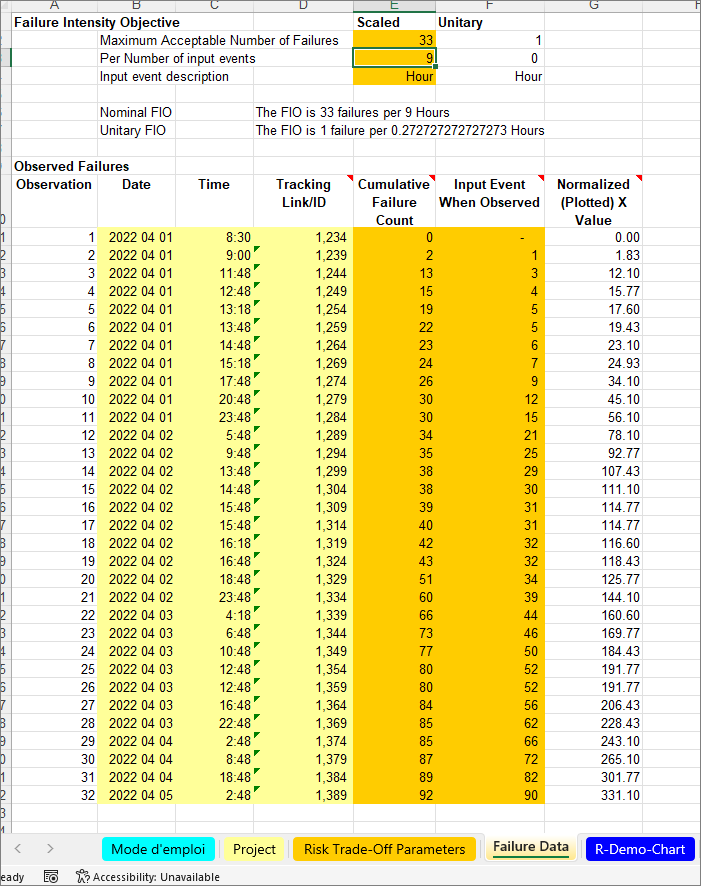

Here is the chart that we reached for MTTF, that most of them are placed in acceptable region.  

Here is the chart that we reached for 2*MTTF.  

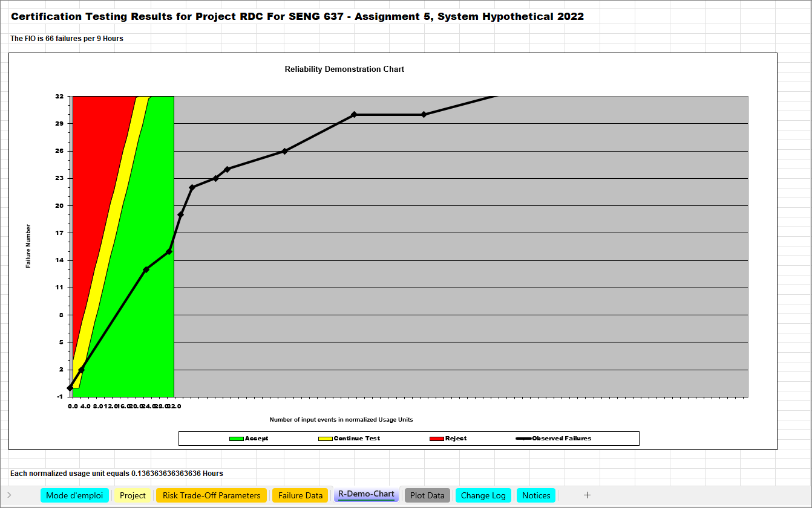

Here is the chart that we reached for MTTF/2.  

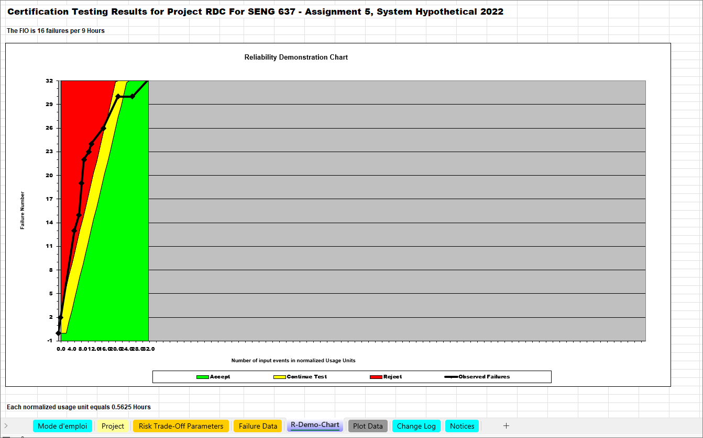

We also tried to test the SRTAT, again we prepared data and as the tool works with seconds, we converted the hours to seconds. However, it seems by giving any numbers the output of the graph is constant. So, we don't think this tool really takes the input data into account. We think our graph from RDC.xls is more accurate. 

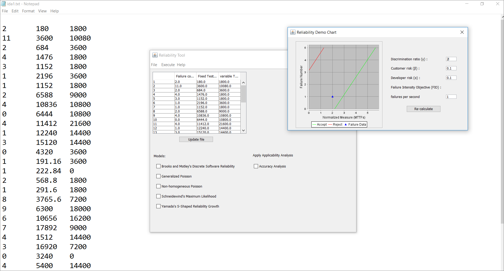

# 4. Comparison of Results

Both the tools used though similar in many aspects are also quite different in some other aspects when it comes to certain functionalities and usage. 

The C-SFRAT tool is very good at predicting the future data given a certain amount of faliure data using all the models that is present. We can select a model based on the different paramteters that suit our requirment and based on that model we can get faliure rates for further intervals of time as well as the amount of intervals it can take to acheive a certain faliure rate. 

We can also use the RDC tool to predict the future faliure data but it is not as quantified or informative as the C-SFRAT tool. The RDC tool is more of a compliace measure tool that helps us define a suitable or optimal MTTF value for the SUT. It helps us understand the relative trend of the SUT. 

It can be seen the above results corroborate the difference between the tools and it is an important difference when it comes to the usage of the tools and implementation.

# 5. Discussion on Similarity and Differences of the Two Techniques

   ## 5.1. Differences:
- Reliability growth testing is performed to assess current reliability of the system, i.e. the current state of th system! So the reliability figures are compared with the intermediate reliability objectives to measure progress and figure how the system is working so far! However, toward the end of the growth testing period to verify that a specific reliability level has been achieved. During a demonstration test, the software code is frozen, just as it would be in field use. In other words, RDT's are usually performed at the system level and is typically set up as a success test!
- RDT can potentially predict the life of the product in the field and the fail time as it's usually performed at system level which is typically success test setup, however reliability growth is whithin the system as a function of assessing the improvement within the progress at a time!
- The original version of the RDC is limited to 16 failure points and it took us few hours to realized how it works internally and then we could extend it for 32 points. However, it seems other tools do not have this limitation. 

## 5.2. Similarities:
- Both of them should be performed under the same conditions as field use. That is, the environment in which the software executes must emulate what the software will experience in the field, and environmental conditions must be maintained throughout the test period. 
- Both of them are based on selecting input states from an input space composed of the input variable values for a particular run. Each of which has specific range and ordering values!
- During growth and demonstration testing the operational profile must be constant and not changed!

# 6. How the team work/effort was divided and managed

We divided the tasks in smaller groups. Mahdi and Rahul were responsible for Reliability Demonstration Chart section, and Shirin and Aadharsh were responsible for Reliability Growth Testing section. After each sub-group finished their part, then we gathered and discussed pros and cons of each method and made a conclusion. During discussion, each subgroup educated the other party who to install and use the tools. Finally we planed for the demo session and made our demo video.

# 7. Difficulties encountered, challenges overcome, and lessons learned

- For SRTAT tool, the only version win64 is working, it seems there are some missing jar/library files for other versions. Also, the help link in SRTAT is not working. For example, we didn't know in 2.5.1.4 how we should use Laplace test in SRTAT. Therefore, it seems SRTAT has many issues on some computers and we didn't know how to fix it lacking source code or user manual.

    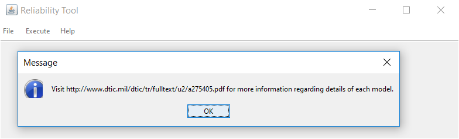

- Moreover, it seems SRTAT does not have any option for model ranking. In slides it is speaking about SRTATA. We couldn't find any download link for that. Also, it was not clear it refers to the same software or not. 

- When we are trying to run CASRE we see the following error. We couldn't run it on windows.

    

- In slides it has been said: 
CASRE ver. 3.0 is available at (http://www.openchannelsoftware.org/discipline/Reliability_Analysis). 

   But this link does not work. However, it seems many options like model ranking as shown in the slides, exist only in CASRE.

- Also, same problems for C-SFRAT. We downloaded it and it is runnable. However, there is no option for model ranking, using Laplace testing or generating time-between-failures, failure intensity and reliability graphs.

# 8. Comments/feedback on the lab itself

This lab was more difficult in comparison to the previous assignments. And the reason for this is the unclear steps in each section. It seems this lab instruction needs to be updated, links need to be checked and those tools that are not runnable anymore in modern operating systems (i.e. CASRE) must be removed from the lab instruction.   

